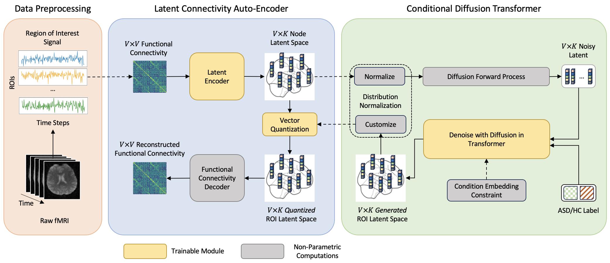

# Brain-Net-Diffusion

<p align="center">
    
</p>

This repository contains PyTorch implementation of Brain-Net-Diffusion for functional connectivity generation and ASD data augmentation.

## 📄 Journal Paper
[Diffusion transformer-augmented fMRI functional connectivity for enhanced autism spectrum disorder diagnosis](https://iopscience.iop.org/article/10.1088/1741-2552/adb07a)

**Authors**:  
Haokai Zhao,
[Haowei Lou](https://scholar.google.com/citations?user=L16GPD0AAAAJ),
[Lina Yao](https://scholar.google.com/citations?user=EU3snBgAAAAJ),
[Yu Zhang](https://scholar.google.com/citations?user=oDrTEi0AAAAJ)

## 🧩 Usage
### 0. Install Requirements
We used python 3.9. All dependencies can be installed with the following command:
```
pip install requirements.txt
```

---

### 1. Download Preprocessed ROI Signal
Phenotypes data of [ABIDE-I](https://fcon_1000.projects.nitrc.org/indi/abide/) is under `data/phenotypes`

Preprocessed ROI signal can be downloaded from AWS Cloud with the following command. Signal files will be downloaded to `./downloads/functionals/cpac/filt_global/rois_cc200`
```sh
python data_prep/download.py
```

---

### 2. Functional Connectivity Construction
Load the fMRI ROI signals and construct functional connnectivity:
```
python data_prep/preprocess.py
```

---


### 3. Split K-Fold data for cross validation
Data is splited according to test site and ASD/HC label, with the following scripts

```sh
python data_prep/data_split.py
```

The split will be saved to `data/split/default/fold_*`

---

### 4. Model Training and Inference
Latent Connectivity Auto-encoding
```
python src/pipeline.py -m -cn vqgae
```

Diffusion training and inference
```
python src/pipeline.py -m -cn ldm_training
```

## BibTex
```
@article{zhao2025diffusion,
  title={Diffusion transformer-augmented fMRI functional connectivity for enhanced autism spectrum disorder diagnosis},
  author={Zhao, Haokai and Lou, Haowei and Yao, Lina and Zhang, Yu},
  journal={Journal of Neural Engineering},
  year={2025}
}
```

## Acknowledgement
This repo is developed based on [lightening-hydra-template](https://github.com/ashleve/lightning-hydra-template) and [DiT](https://github.com/facebookresearch/DiT)

